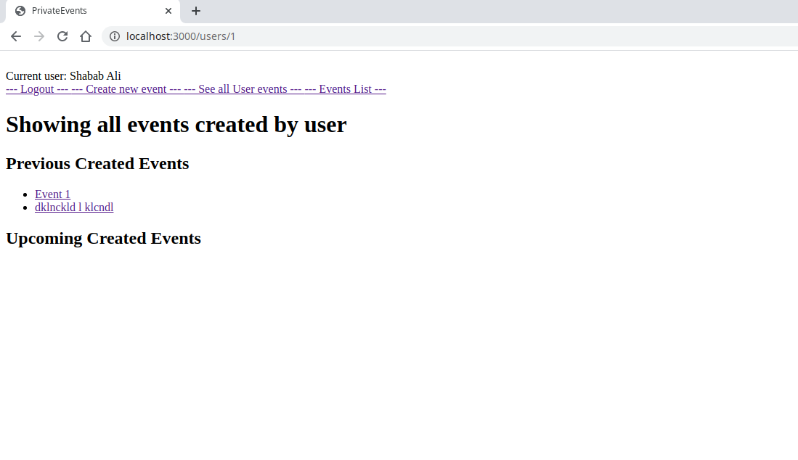
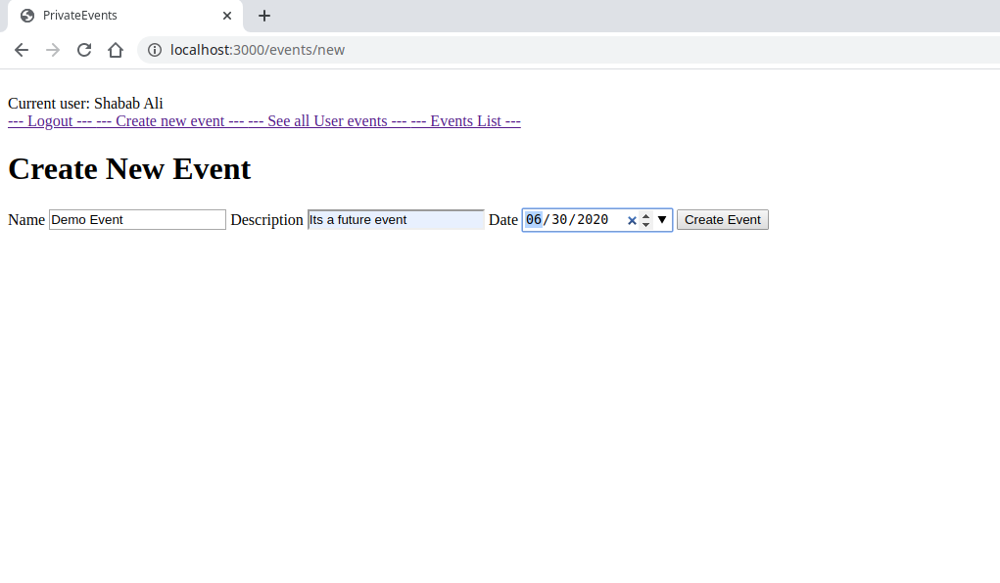

[](mailto:consult.ikraam@gmail.com) [](https://twitter.com/GhoorIkraam)

[](mailto:shababsaifi@gmail.com) [](https://twitter.com/shabab_ali)

# Private Events

> In this project, we implemented a site similar to Eventbrite which allows users to create events and then manage user signups. Users can create events and send invitations and invite other users. We also did unit tests using RSpec and Integration tests using Capybara.

>Logged in user can see events created by him.


>Logged in user can create a new event.



## Built With

- Ruby 2.6.5 and Rails 5.2.4.2
- RSpec
- Capybara

## Getting Started

To get a local copy up and running follow these steps:

### Prerequisites

- Ruby and Git installed on local machine.

### Testing
```Ruby
cd private-events
bundle install
bundle exec rspec
 ```

### Usage

- Fork/Clone this project to your local machine
- Open folder in your local enviroment and run thes lines of code to get started:

```Ruby
cd private-events
bundle install
rails db:migrate
rails s 
```

- Open the browser and go to [port 3000 on your local machine.](http://localhost:3000)
- The original project can be found on this [Odin Project page](https://www.theodinproject.com/courses/ruby-on-rails/lessons/associations).

## Authors

👤 **Ikraam Ghoor**

- Github: [@ikraamg](https://github.com/ikraamg)
- Twitter: [@GhoorIkraam](https://twitter.com/GhoorIkraam)
- LinkedIn: [isghoor](https://linkedin.com/isghoor)
- Email: [consult.ikraam@gmail.com](mailto:consult.ikraam@gmail.com)

👤 **Shabab Ali**

- Github: [@alishabab](https://github.com/alishabab)
- Twitter: [@shabab_ali](https://twitter.com/shabab_ali)
- LinkedIn: [shababali](https://www.linkedin.com/in/shababali/)
- Email: [shababsaifi@gmail.com](mailto:shababsaifi@gmail.com)

## 🤝 Contributing

Contributions, issues and feature requests are welcome!

Feel free to check the [issues page](https://github.com/alishabab/private-events/issues)

Start by:

- Forking the project
- Cloning the project to your local machine
- `cd` into the project directory
- Run `git checkout -b your-branch-name`
- Make your contributions
- Push your branch up to your forked repository
- Open a Pull Request with a detailed description to the development(or master if not available) branch of the original project for a review

## Show your support

Give a ⭐️ if you like this project!

## Acknowledgments

- The Odin project for the [project plan](https://www.theodinproject.com/courses/ruby-on-rails/lessons/associations).

## 📝 License

This project is [MIT](LICENSE.md) licensed
